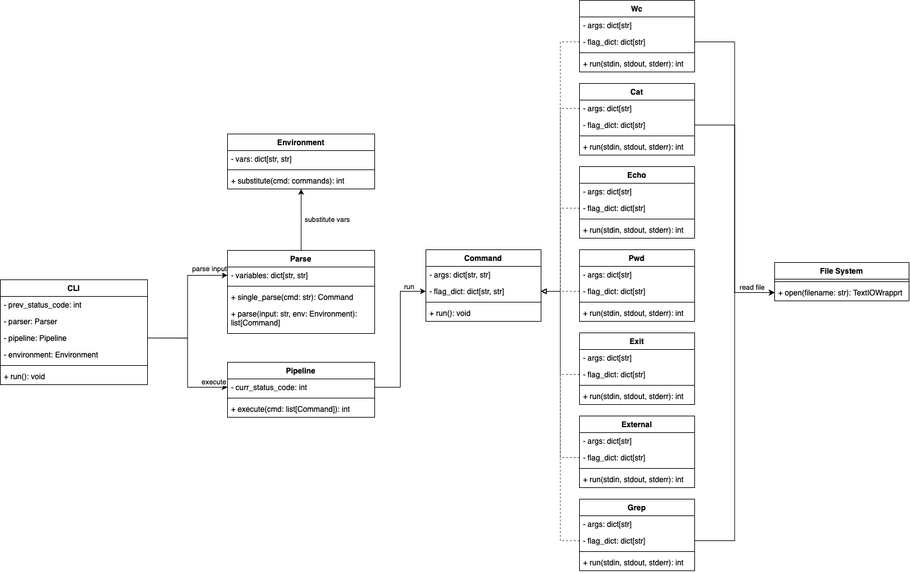

# Архитектурная документация CLI по IEEE 42010:2011

# Общая информация о документе и о системе
Документ описывает архитектуру CLI-интерфейса, его компоненты, взаимодействия и принципы работы.

### Описание системы
Система представляет собой командный интерпретатор (CLI), предназначенный для обработки пользовательского ввода, выполнения команд и управления окружением. 
Интерпретатор должен уметь работать с пайплайнами (оператор “|”), переменными окружения, двойными и одинарными кавычками. 
Должны поддерживаться команды:
* cat [FILE] — вывести на экран содержимое файла
* echo — вывести на экран свой аргумент (или аргументы)
* wc [FILE] — вывести количество строк, слов и байт в файле
* pwd — распечатать текущую директорию
* exit — выйти из интерпретатора
* grep — утилита командной строки, которая находит на вводе строки, отвечающие заданному регулярному выражению, и выводит их.
* вызов внешней программы через Process (или его аналоги), если введенная команда не описана выше.
 

# Стейкхолдеры и их интересы
#### Разработчик

`Интересы`:
* Простота поддержки и чёткое разделение ответственности между компонентами.
* Использование стандартных библиотек Python (subprocess) для обработки команд. 
* Легкая модифицируемость и Масштабируемость.
* Простота добавления новых встроенных команд путём добавления наследников интерфейса `Command`. 
* Полная документация.

#### Пользователь

`Интересы`:
* Простой и интуитивно понятный синтаксис команд.
* Поддержка стандартных инструментов терминала (cat, echo, wc, pwd, exit, grep).
* Возможность использования переменных окружения.
* Обработка ошибок с информативными сообщениями.
* Поддержка пайплайнов для последовательного выполнения команд.
* Интерпретатор должен работать двойными и одинарными кавычками. 
* Полная документация.

#### Тестировщики
`Интересы`:
* Модульность
* Простота тестирования
* Предсказуемое поведение
* Четкие и понятные сообщения об ошибках

### Определение Viewpoint-ов

#### Контекст
+ Описание:
    1) Есть терминал пользователя, из которого он запускает приложение через интерпретатор Python.
    2) После этого запускается приложение, которое бесконечно читает и исполняет команды, пока пользователь не введет символ завершения ввода. Часть команд реализуется самим приложением, остальные он делегирует встроенному интерпретатору.
    3) Любая команда состоит из названия флагов, возможных аргументов флагов и возможных основных аргументов.
    4) Ожидается поддержка пайпов, которые передают результат одного процесса другому.
  
#### Алгоритм 
+ Описание системы: 
    1) Main инициализирует и запускает `CLI`
    2) В `CLI` крутится бесконечный цикл, который считывает ввод из терминала. 
    3) `CLI` вызывает `Parse.run` для входного потока. 
    4) `Parse`, вызывая `Environment.substitute_vars` выполняет подстановку переменных окружения. 
  5) Делаем сплит по '|'
  6) Для каждой части определяем, инициализирует ли пользователь переменную окружения или просит исполнить команду. 
  7) Если это новая переменная, то мы добавим ее в `Environment`
  8) Если это команда, то обращаясь к `CommandFactory` получаем объект соответствующего команде наследника класс `Command`
  9) После получения списка наследников `Command`, `CLI` запускается выполнение этих команд, используя `pipeline.execute`
  10) `Pipline` перенаправляет потоки ввода и вывода и просит выполнить наследника `Command` соответсвующее ему действие, путём вызова `Command.run`
  11) Если подкоманда в `Pipline` завершилась с ошибкой, то код ошибки и сообщение о ней передается в `CLI`, в поток вывода ничего не выводится, иначе исполняем следующий кусок по циклу. 
  12) Последняя команда в `Pipline` выводит свой вывод в стандартный поток вывода.
  

### Основные компоненты
| Компонент          | Описание                                                                                                |
|--------------------|---------------------------------------------------------------------------------------------------------|
| **CLI**            | Точка входа, где пользовательский вход обрабатывается парсером и передается в `Pipeline`                |
| **Parser**         | Разбирает ввод пользователя и создаёт список объектов `Command` или устанавливает переменные окружения. |
| **CommandFactory** | Помогает `Parser` создать соответсвующего команде наследника `Command`.                                 |
| **Command**        | Инкапсулирует всю логику Bash-команды.                                                |
| **Environment**    | Управляет переменными окружения во время работы скрипта.                                                    |
| **Pipeline**       | Перенаправляет потоки ввода/вывода при использовании конвейеров.                                            |

### Взаимодействие компонентов
1. `СLI` считывает команду, получается список команд при помощи `Parser` и отдаёт на исполнение в `Pipeline`
2. `Parser` обращается к `Environment`, чтобы сделать подстановку
3. `Parser` обращается к `CommandFactory`, создать нужного наследника `Command`
4. `Pipeline` запускает соответствующую `Command` при помощи функции `run()`
5. `Command` может обращаться к файловой системе

## Реализация и ограничения

### Основные принципы реализации
- Параллельного выполнение не предусмотрено.
- Встроенные команды (`cat`, `echo`, `wc`, `pwd`, `exit`) реализованы непосредственно в коде, а остальные передаются `subprocess`.
- Команды, соединённые через `|`, выполняются СЛЕВА-НАПРАВО и ПОСЛЕДОВАТЕЛЬНО. Это наше архитектурное решение.

### Технические требования

- `cat` — вывести на экран содержимое файла;
- `echo` — вывести на экран свой аргумент (или аргументы);
- `wc` — вывести количество строк, слов и байт в файле;
- `pwd` — распечатать текущую директорию;
- `exit` — выйти из интерпретатора;
- если введено что-то, чего интерпретатор не знает — вызов внешней программы.

- Должна быть поддержка одинарных и двойных кавычек
- Переменные окружения должны поддерживаться и передаваться внешнему процессу при запуске
- Для команд должны поддерживаться потоки вывода, ошибок и код возврата

### Ограничения
- Нет поддержки фоновых процессов.
- Нет асинхронного выполнения команд.
- Нет поддержки логических операторов (&&, ||).
- Нет поддержки установки переменных в окружении в пайплайнах, подразумевается, что это всегда отдельная строка всегда.

# Обоснование архитектуры
* Для команд использован паттерн фабрика
  * Плюсы: простая реализация и читаемость, создание объектов в одном месте.
  * Минуcы: при добавлении новой команды нужно редактировать фабрику, однако необходимо добавить лишь одну запись в Enum
* Переменные выполняются до разбиения на токены
  * Плюсы: предсказуемое поведение и простота понимания работы парсера
* Для обработки параметров использована библиотека argparse
  * Альтернативы: click, typer
  * Аргументация выбора: 
    * простой синтаксис
    * наличие опыта работы с данным инструментом
    * не нужно устанавливать
    * работает с любыми версиями python

## Заключение
Документ описывает архитектуру CLI на основе IEEE 42010:2011, определяя её основные компоненты, 
взаимодействия и ограничения. Система поддерживает выполнение команд, 
управление окружением и обработку пайпов, 
но не включает поддержку фоновых задач и логические операторы
