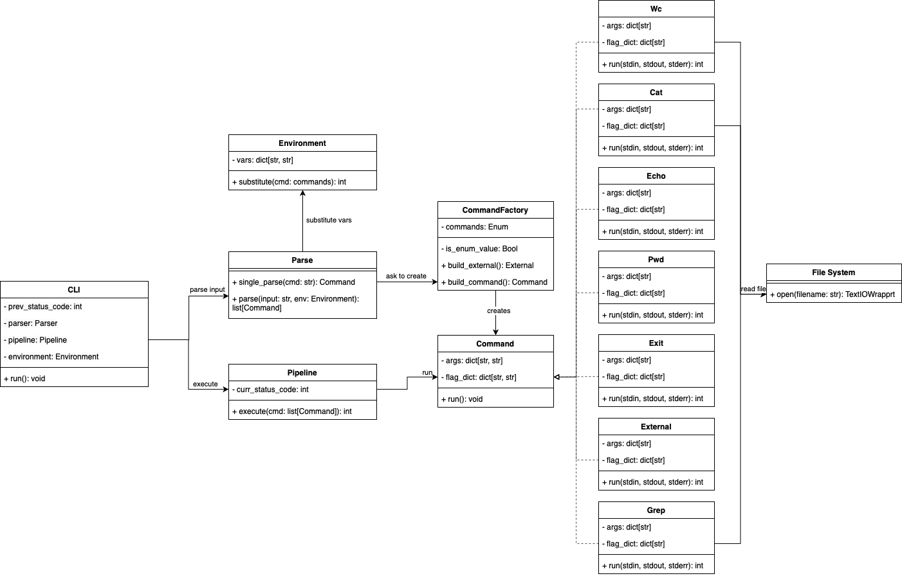

# Архитектурная документация CLI по IEEE 42010:2011

# 1. Общая информация о документе и о системе
Документ описывает архитектуру CLI-интерфейса, его компоненты, взаимодействия и принципы работы.

### Описание системы
Система представляет собой командный интерпретатор (CLI), предназначенный для обработки пользовательского ввода, выполнения команд и управления окружением. 
Интерпретатор должен уметь работать с пайплайнами (оператор “|”), переменными окружения, двойными и одинарными кавычками. 
Должны поддерживаться команды:
* cat [FILE] — вывести на экран содержимое файла
* echo — вывести на экран свой аргумент (или аргументы)
* wc [FILE] — вывести количество строк, слов и байт в файле
* pwd — распечатать текущую директорию
* exit — выйти из интерпретатора
* grep — утилита командной строки, которая находит на вводе строки, отвечающие заданному регулярному выражению, и выводит их.
* вызов внешней программы через Process (или его аналоги), если введенная команда не описана выше.
 

# 2. Стейкхолдеры и их интересы
#### Разработчик

`Интересы`:
* Простота поддержки и чёткое разделение ответственности между компонентами.
* Использование стандартных библиотек Python (subprocess) для обработки команд. 
* Легкая модифицируемость и Масштабируемость.
* Простота добавления новых встроенных команд путём добавления наследников интерфейса `Command`. 
* Полная документация.

#### Пользователь

`Интересы`:
* Простой и интуитивно понятный синтаксис команд.
* Поддержка стандартных инструментов терминала (cat, echo, wc, pwd, exit, grep).
* Возможность использования переменных окружения.
* Обработка ошибок с информативными сообщениями.
* Поддержка пайплайнов для последовательного выполнения команд.
* Интерпретатор должен работать двойными и одинарными кавычками. 
* Полная документация.

#### Тестировщики
`Интересы`:
* Модульность
* Простота тестирования
* Предсказуемое поведение
* Четкие и понятные сообщения об ошибках

### Определение Viewpoint-ов

#### Контекст
+ Описание:
    1) Есть терминал пользователя, из которого он запускает приложение через интерпретатор Python.
    2) После этого запускается приложение, которое бесконечно читает и исполняет команды, пока пользователь не введет символ завершения ввода. Часть команд реализуется самим приложением, остальные он делегирует встроенному интерпретатору.
    3) Любая команда состоит из названия флагов, возможных аргументов флагов и возможных основных аргументов.
    4) Ожидается поддержка пайпов, которые передают результат одного процесса другому.
#### Алгоритмы (более подробное описание)
+ Описание системы: 
    1) в `Main` крутится бесконечный цикл, который считывает ввод из терминала. 
    2) Через регулярное выражение мы определяем, инициализирует ли пользователь переменную окружения или просит исполнить команду.
    3) Если это новая переменная, то мы добавим ее в `Environment`, иначе переходим к 4.
    4) Мы делаем сплит по '|'. В `ProcessManager` проходимся в цикле по кускам. В кусок он выполняет подстановку переменных окружения: ищет все слова, начинающиеся с большого доллара (через регулярное выражение). Пробует сделать подстановку из `Environment` и либо она успешна и мы идем к 5. , либо он сообщает об ошибке и мы переходим на очередную итерацию
    5) Если в списке кусочков есть следующий, то мы создаем файловый дескриптор, которым подменяем sys.stdout, а перед запуском новой команды вычитываем файл и присоединяем через пробел к строке новой команды до парсинга.
    6) Делаем парсинг в `Parser`: сплит по пробелам. Первый токен это имя команды. Для сторонних команд мы должны передать подпроцессу оставшиеся токены, поэтому дополнительной обработки флагов и их аргументов не требуется. Если команда одна из встроенных, то нужно поддержать флаги и аргументы. Флаги бывают двух видов: из одного - и буквы и из -- и слова. Под каждый вид делаем регулярное выражение. Проходим по списку токенов и проверяем регулярные выражения. Мы идем окном из двух токенов: если первый токен оказался флагом, то возможно, что второй токен это аргумент (если не флаг), тогда нужно добавить их в словарь. Если оба токена это флаги то первый флаг мы добавляем в словарь с аргументом None. Если первый токен это не флаг и мы не добавляли его в аргументы флага на предыдущем шаге, то это аргумент и мы добавляем его в список аргументов. Итого получаем `Command`, состоящий из имени команды, списка аргументов, словаря флагов и их аргументов.
    7) `Executor` в зависимости от имени команды выбирает, вызвать подпроцесс или вызвать одну из готовых реализаций. Готовые реализации по количеству аргументов могут завершиться с ошибкой или исполниться. 
    8) Если подкоманда `Executor` завершилась с ошибкой, то код ошибки и сообщение о ней просто передается наверх в `Main` часть, иначе исполняем следующий кусок по циклу. В случае, когда куски кончились - идем на новую итерацию.
#### 2.1.3 Динамика состояний
    Интерес стэйкхолдеров: разработчики должны понимать, как обрабатывать выход из программы, в каком виде существуют ошибки и как обрабатываются; пользователи хотят знать, как им выйти из программы, может ли она завершиться из-за ошибки.

    Описание системы: бесконечный цикл ввода прерывается либо вводом команды exit, которая в реализации вызывает exit(0), либо вводом Ctrl+D. Любая ошибка просто заканчивает исполнение текущей строки и мы переходим на следующую итерацию. Вызов команды exit так же прерывает весь пайплайн. Сообщение об ошибке прокидывается наверх до `main` цикла.

#### 2.1.4 Структура данных
    Интерес стэйкхолдеров: самый главный интерес разработчиков это то, как хранится команда, а также им нужно знать, как представляется окружение. Это влияет на расширяемость и простоту рефакторинга. 

    Описание системы: 
    `Environment` - просто словарь, который инициализируется существующими системными переменными.

    Command в случае, когда это поддерживаемая нами команда - тройка из имени команды, списка токенов-аргументов, словаря флагов и их аргументов, а когда неизвестная - просто список токенов.

### 2.2 Основные компоненты
| Компонент          | Описание                                                                                                    |
|--------------------|-------------------------------------------------------------------------------------------------------------|
| **Parser**         | Разбирает ввод пользователя и создаёт объект `Command` или устанавливает переменные окружения.              |
| **CLI**            | Точка входа, где пользовательский вход обрабатывается парсером и передается в `Pipeline`                    |
| **Command**        | Инкапсулирует всю логику Bash-команды.                                                |
| **Environment**    | Управляет переменными окружения во время работы скрипта.                                                    |
| **Pipeline**       | Перенаправляет потоки ввода/вывода при использовании конвейеров.                                            |

### 2.3 Взаимодействие компонентов
1. `СLI` считывает команду, получается список комманд при помощи парсера и отдаёт на исполнение в `Pipeline`
2. `Parser` обращается к `Environment`, чтобы сделать подстановку
3. `Pipeline` после разделения по '|' запускает соответствующие `Command` при помощи функции `run()`
4. `Command` может обращаться к файловой системе
5.  В конце выполнения конвейера `СLI` устанавливает код завершения команды.
6. `Executor` определяет тип команды и либо вызывает встроенную реализацию, либо использует `subprocess` для запуска внешних процессов.

1. `СLI` считывает команду, получается список комманд при помощи парсера и отдаёт на исполнение в ]
1. `Main` получает команды и делает разделение команд по '|'. Отдает этот список `ProcessManager`.
2. `ProcessManager` делает подстановки из `Environment`, а `Parser` формирует команду `Command`.
3. `ProcessManager` получает команду и создаёт `Executor`, назначая ему команду. Если используется конвейер, `ProcessManager` управляет входными и выходными потоками.
4. `Executor` определяет тип команды и либо вызывает встроенную реализацию, либо использует `subprocess` для запуска внешних процессов.

## 3. Реализация и ограничения

### 3.1 Основные принципы реализации
- Параллельного выполнение не предусмотрено.
- Встроенные команды (`cat`, `echo`, `wc`, `pwd`, `exit`) реализованы непосредственно в коде, а остальные передаются `subprocess`.
- Команды, соединённые через `|`, выполняются СЛЕВА-НАПРАВО и ПОСЛЕДОВАТЕЛЬНО. Это наше архитектурное решение.

### 3.2 Технические требования

- `cat` — вывести на экран содержимое файла;
- `echo` — вывести на экран свой аргумент (или аргументы);
- `wc` — вывести количество строк, слов и байт в файле;
- `pwd` — распечатать текущую директорию;
- `exit` — выйти из интерпретатора;
- если введено что-то, чего интерпретатор не знает — вызов внешней программы.

- Должна быть поддержка одинарных и двойных кавычек
- Переменные окружения должны поддерживаться и передаваться внешнему процессу при запуске
- Для команд должны поддерживаться потоки вывода, ошибок и код возврата

### 3.3 Ограничения
- Нет поддержки фоновых процессов.
- Нет асинхронного выполнения команд.
- Нет поддержки логических операторов (&&, ||).

## 4. Заключение
Документ описывает архитектуру CLI на основе IEEE 42010:2011, определяя её основные компоненты, 
взаимодействия и ограничения. Система поддерживает выполнение команд, 
управление окружением и обработку пайпов, 
но не включает поддержку фоновых задач и логические операторы
